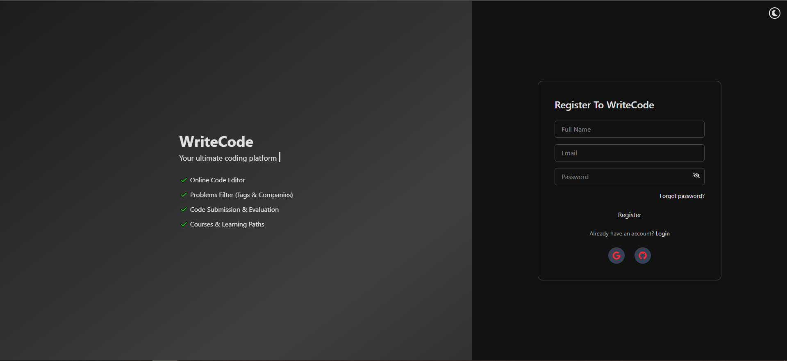
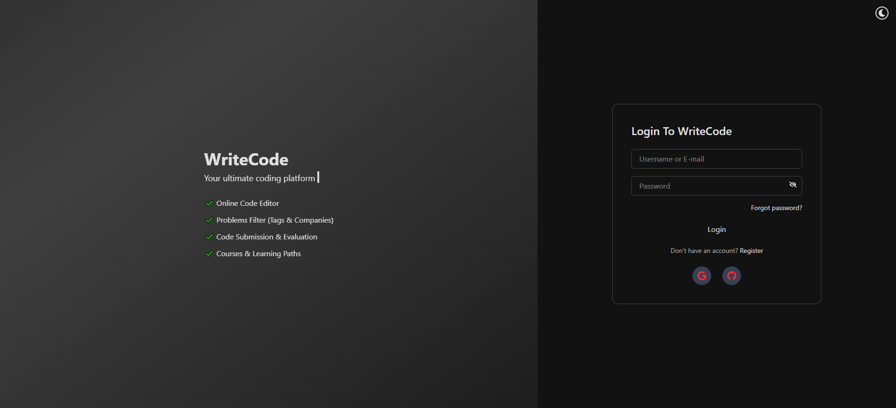
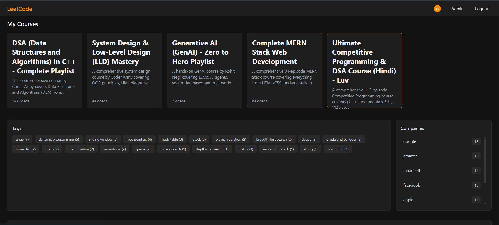
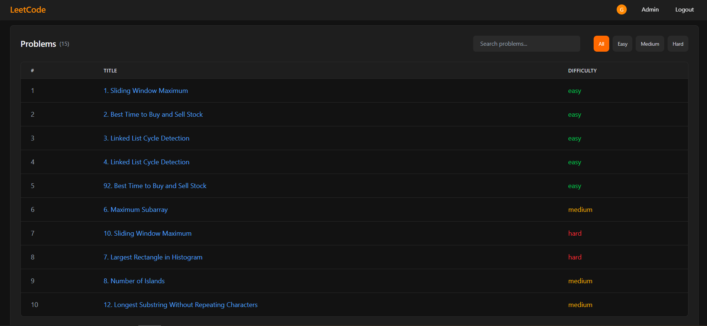
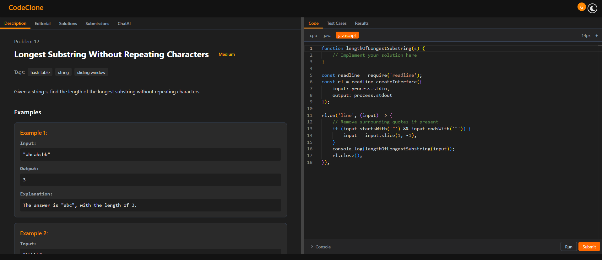
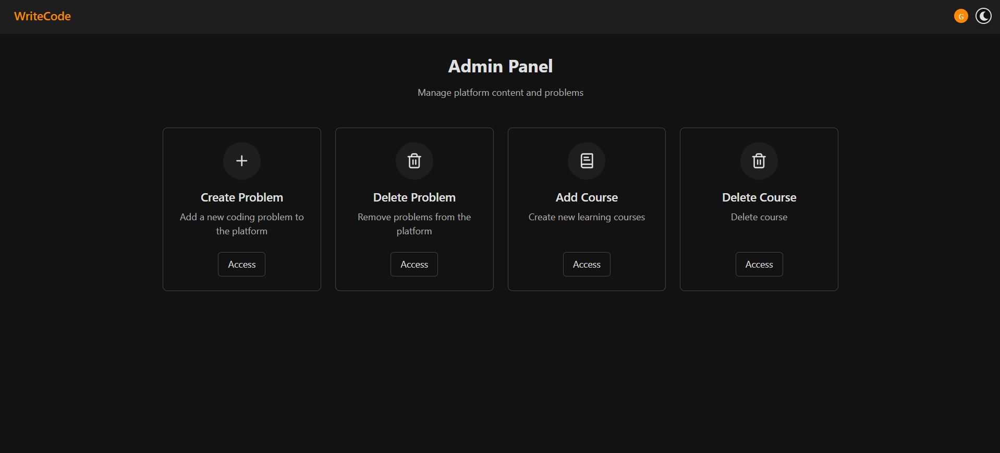
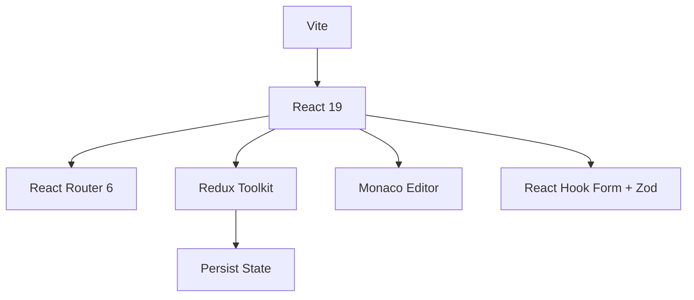
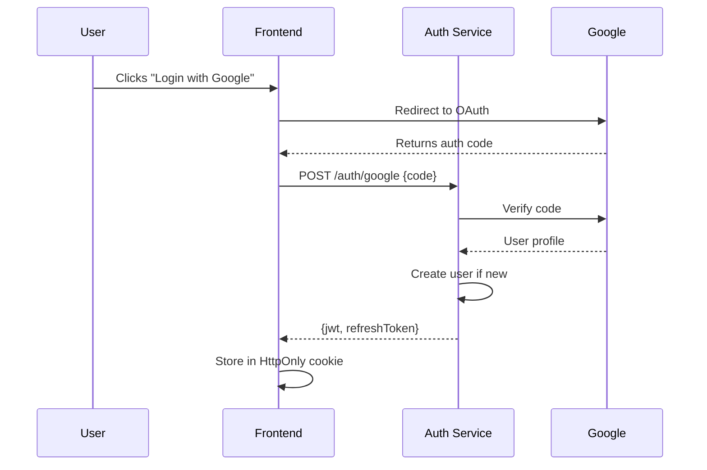

# WriteCode - Full-Stack Coding Platform

A LeetCode-style platform with AI-powered coding assistance, featuring:
- Problem solving interface with real-time output
- User authentication (Google/GitHub/Email)
- Admin dashboard for problem management
- Microservices backend architecture

## 🌟 Features
**Frontend:**
- Monaco Editor with custom keybindings
- JWT-based authentication with refresh tokens
- Redux state management with persistence
- TailwindCSS with dark/light mode toggle
- Multi-tab problem interface (Description, Solutions, AI Chat)

**Backend Services:**
1. **Authentication Service**: 
   - OAuth2 (Google/GitHub) 
   - Email verification with rate limiting
   - Password reset flow
2. **Problem Service**: 
   - CRUD operations with versioning
   - Test case evaluation engine
   - Google GenAI integration for hints
  

## 📸 Screenshots
| Page | Screenshot |
|------|------------|
| **RegisterPage** |  |
| **loginPage** |  |
| **HomePage** |  |
| **HomePage** |  |
| **Problem Solving** |  |
| **Admin Dashboard** |  |

## 🛠 Tech Stack (Detailed)
**Frontend Architecture:**


**Backend Services:**
| Service | Tech | Key Packages |
|---------|------|--------------|
| **API Gateway** | Node.js | Express, http-proxy-middleware |
| **Auth Service** | Node.js | Passport, jsonwebtoken, bcrypt |
| **Problem Service** | Node.js | Mongoose, Google GenAI SDK |
| **Database** | MongoDB | Atlas, Mongoose ODM |


## 🚀 Installation (Detailed)
### Prerequisites
- Node.js v18+ (recommend using nvm)
- MongoDB Atlas URI (free tier sufficient)
- Redis server (local or cloud)
- Google OAuth credentials
- Google GenAI API key


### Manual Setup
```bash
# Frontend
cd frontend
npm install
npm run dev

# Auth Service (port 3001)
cd auth-service
npm install
npm run migrate # for initial DB setup
npm run dev

# Problem Service (port 3002)
cd problem-service
npm install
npm run seed # optional sample problems
npm run dev
```

## 📂 Project Structure (Expanded)
```
frontend/
├── public/              # Static assets
├── src/
│   ├── assets/          # SVGs, images
│   ├── components/      # Atomic design structure
│   │   ├── atoms/
│   │   ├── molecules/
│   │   └── organisms/
│   ├── features/        # Redux slices
│   ├── hooks/           # Custom hooks
│   ├── layouts/         # Page wrappers
│   ├── pages/           # Next.js-style routing
│   ├── services/        # API clients
│   └── utils/           # Helpers, constants

auth-service/
├── src/
│   ├── middlewares/     # Auth guards
│   ├── strategies/      # Passport configs
│   ├── services/        # Email, token services
│   └── validations/    # Joi schemas

problem-service/
├── testcases/           # Problem test cases
├── src/
│   ├── evaluator/       # Code execution logic
│   ├── ai/             # GenAI integration
│   └── seeders/        # Sample problems
```

## 🔍 Technical Documentation
### Authentication Sequence


### Code Evaluation Flow
1. User submits code
2. Problem service:
   - Creates isolated Docker container
   - Runs against test cases
   - Compares outputs with expected results
   - Stores submission in MongoDB
3. Returns detailed results:
   ```json
   {
     "status": "Accepted",
     "runtime": "45ms",
     "memory": "12.3MB",
     "testCases": [
       {"input": "5", "output": "120", "expected": "120", "passed": true}
     ]
   }
   ```

## 🌐 API Endpoints
| Service | Route | Method | Description |
|---------|-------|--------|-------------|
| **Auth** | `/auth/google` | POST | Initiate OAuth flow |
| **Auth** | `/auth/refresh` | GET | Refresh JWT token |
| **Problem** | `/problems/:id` | GET | Get problem details |
| **Problem** | `/problems/submit` | POST | Submit solution |
